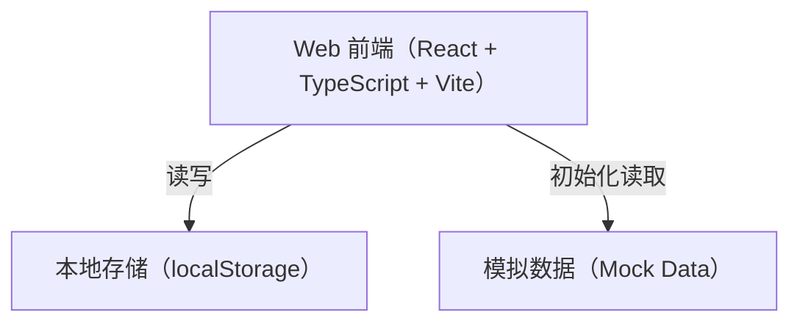

## 1. 架构设计



## 2. 技术选型

- **前端框架**：React@18 + TypeScript
- **构建工具**：Vite
- **样式方案**：Tailwind CSS
- **状态管理**：Zustand（管理用户登录态、全局状态）
- **路由**：React Router DOM v6
- **图标**：Lucide React
- **数据层**：localStorage 本地存储 + 内置 Mock 数据
- **部署**：静态站点部署（Vercel / Netlify / GitHub Pages）

## 3. 路由定义

| 路由路径 | 页面名称 | 页面标题 | 说明 |
|---------|---------|---------|------|
| `/` | 首页 | 知识星球 | 首页，底部导航页之一 |
| `/category` | 分类浏览 | 分类浏览 | 分类筛选页，底部导航页之一 |
| `/mine` | 个人中心 | 个人中心 | 用户个人中心，底部导航页之一 |
| `/detail/:id` | 文章详情 | 文章详情 | 内容详情页，非 Tab 页 |
| `/login` | 登录 | 登录 | 手机号登录页，非 Tab 页 |

## 4. 数据模型

### 4.1 内容数据模型（Content）

| 字段 | 类型 | 说明 |
|------|------|------|
| id | string | 唯一标识 |
| title | string | 文章标题 |
| summary | string | 简介摘要 |
| coverUrl | string | 封面图链接 |
| category | string | 分类标签（学习方法/人工智能/自我管理） |
| author | Author | 作者信息 |
| price | number | 价格（0=免费） |
| content | string | 完整正文（HTML/Markdown） |
| previewContent | string | 付费内容预览部分 |
| readCount | number | 阅读人数 |
| likeCount | number | 点赞数 |
| publishDate | string | 发布日期 |
| isFree | boolean | 是否免费 |

### 4.2 用户数据模型（User）

| 字段 | 类型 | 说明 |
|------|------|------|
| phone | string | 手机号（唯一标识） |
| nickName | string | 用户昵称 |
| avatarUrl | string | 头像链接 |
| purchasedIds | string[] | 已购内容 ID 列表 |
| favoriteIds | string[] | 收藏内容 ID 列表 |
| historyIds | string[] | 浏览历史 ID 列表 |

### 4.3 本地存储结构

| Key | 存储内容 | 说明 |
|-----|---------|------|
| `mock_contents` | Content[] | 内置 20 条演示内容数据 |
| `users` | Record<string, User> | 所有用户数据（以手机号索引） |
| `currentUser` | User | null 当前登录用户 |

## 5. 组件树结构

```
App
├── Layout
│   ├── Header（顶部状态栏）
│   ├── TabBar（底部导航）
│   └── ContentArea（路由出口）
│
├── Pages
│   ├── HomePage
│   │   ├── SearchBar
│   │   ├── BannerCarousel
│   │   ├── CategoryTabs
│   │   └── ContentList
│   │       └── ContentCard
│   │
│   ├── DetailPage
│   │   ├── ContentHeader
│   │   ├── ContentBody
│   │   ├── PayOverlay（付费遮罩）
│   │   └── CommentSection
│   │
│   ├── CategoryPage
│   │   ├── CategoryNav
│   │   └── ContentGrid
│   │       └── ContentCard
│   │
│   ├── MinePage
│   │   ├── UserInfo
│   │   ├── StatsBar
│   │   └── MenuList
│   │
│   └── LoginPage
│       ├── PhoneInput
│       ├── CodeInput
│       └── LoginButton
│
├── Components（通用）
│   ├── ContentCard
│   ├── EmptyState
│   ├── ErrorState
│   ├── LoadingSkeleton
│   └── PayModal
│
└── Store（Zustand）
    ├── userStore（用户状态）
    └── contentStore（内容状态）
```

## 6. 状态管理设计

### userStore（Zustand）

```typescript
interface UserStore {
  currentUser: User | null
  isLoggedIn: boolean
  login: (phone: string, code: string) => boolean
  logout: () => void
  purchaseContent: (contentId: string) => void
  toggleFavorite: (contentId: string) => void
  addHistory: (contentId: string) => void
  isPurchased: (contentId: string) => boolean
  isFavorited: (contentId: string) => boolean
}
```

### contentStore（Zustand）

```typescript
interface ContentStore {
  contents: Content[]
  currentCategory: string
  searchKeyword: string
  filteredContents: Content[]
  setCategory: (category: string) => void
  setSearchKeyword: (keyword: string) => void
  getContentById: (id: string) => Content | undefined
}
```

## 7. Mock 数据设计

- 内置 20 条演示内容，覆盖 4 个分类
- 其中约 40%（8 条）为付费内容，60%（12 条）为免费内容
- 封面图使用 Unsplash 占位图
- 正文内容使用真实长短文混合
- 数据在应用首次启动时初始化至 localStorage